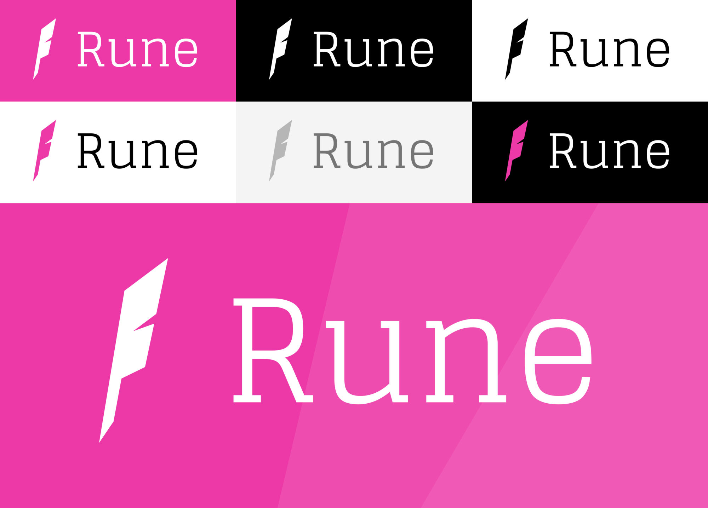
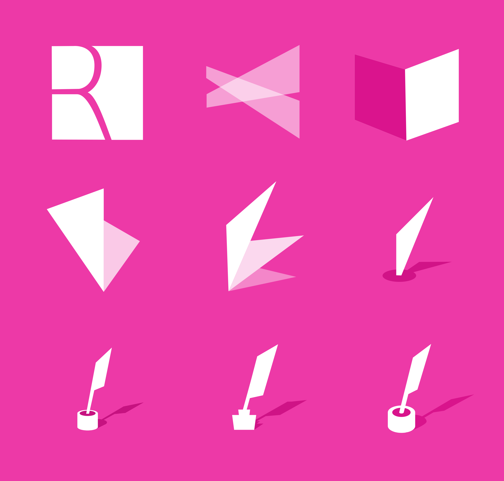

# Rune Logo

[Rune](http://runemag.mit.edu/), MIT's literature and arts journal, was in need of a new logo. I took this opportunity to get my hands dirty in a medium less familiar to me: Motion Design. After creating a static 2D banner, I brought the logo to life with a 10 second animated intro.

[Watch the Video](https://www.youtube.com/watch?v=Hkv235UgQwA)

---

## Behind the Scenes

---

Learning Focus: Motion Design, Logo Design

Media: Motion Graphic, Animation, Vector Graphic

Software: Inkscape, GIMP, Blender

Date: November 2016
